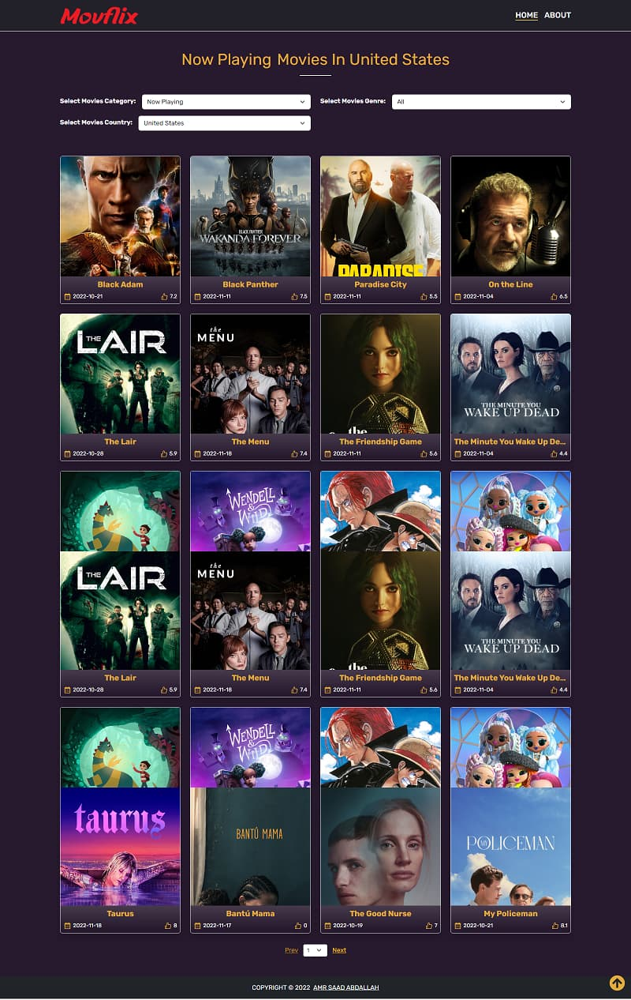
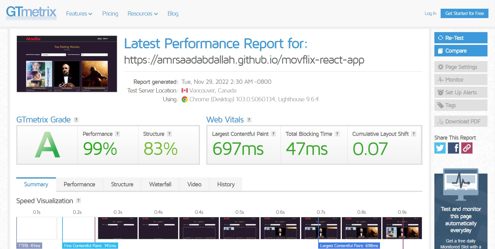

<h1 align="center" >Movflix &mdash; React App</h1>

### 👁️ Project Preview:

- [ Live Preview 👉 https://amrsaadabdallah.github.io/movflix-react-app](https://amrsaadabdallah.github.io/movflix-react-app)

- [ Github Repo 👉 https://github.com/amrsaadabdallah/my-movflix-react-app](https://github.com/amrsaadabdallah/my-movflix-react-app)
  - 🚩 It's a private repo <a target="_blank" href="mailto:amrsaadabdallah@gmail.com">contact me </a>to see.

---

### 📝 Project Description & features:

- It's a react app (movflix) used to practice react feature and redux.

- It consists of 4 pages (home, about, movie-details).

- I use [TMDB API](https://www.themoviedb.org/) to fetch movies & TV series data.

- You can filter movies depend on multiple categories (Top Rating, now playing, popular, upcoming).

- Also can determine genre of movies data depend on multiple categories ( Action, Adventure, Animation, Comedy, Crime, Documentary, Drama, Family, Fantasy, History, Horror, Music, Myster,y Romance, Science, Fiction, TV Movie, Thriller, War, Western ).

- For movies Categories [now playing or upcoming] can filter depend on a certain country.

  - [First API URL](`https://api.themoviedb.org/3/movie/${category}?api_key=${APIKey}&language=en-US&with_genres=${genre}&page=${page}&region=''`) (`https://api.themoviedb.org/3/movie/${category}?api_key=${APIKey}&language=en-US&with_genres=${genre}&page=${page}&region=''`) => used to fetch movies Categories [Top Rating or Most Popular].

  - [Secound API URL](`https://api.themoviedb.org/3/movie/${category}?api_key=${APIKey}&language=en-US&with_genres=${genre}&page=${page}&region=${country}`) (`https://api.themoviedb.org/3/movie/${category}?api_key=${APIKey}&language=en-US&with_genres=${genre}&page=${page}&region=${country}`)
    => used to fetch movies Categories [now playing or upcoming].

---

### 🛠️ Project Tools:

1. Used Google Fonts.

1. Bootstrap Classes for styling.

1. react-icons pack for getting icons.

1. ReactJS Library.

1. react-router-dom pack for handling Client side routing.

1. Axios is a stand-alone third party package that used for making HTTP requests to APIs.

1. [TMDB API](https://www.themoviedb.org/) to fetch movies & TV series data.

1. PropTypes package for typechecking component props.

1. [Squoosh](https://squoosh.app/) is an online tool for image compression web app that reduces image sizes through numerous formats.

1. [GTmetrix](https://gtmetrix.com/) is an online tool for customers to easily test the performance of their webpages.

---

### :sparkles: Project Skills applied:

1. Create Multiple React Component.

1. Configuration react component by props.

1. Render List of items.

1. Apply Conditional Rendering.

1. Deal with form.

1. Deal with redux library.

1. Fetching Dtat from APIs.

1. Use React Hook (UseState, useEffect).

1. Ability to another page photos by using [infinite scroll](https://blog.saeloun.com/2022/07/08/react-custom-infinite-scroll-with-pagination.html).

1. Typechecking component props With PropTypes package.

1. Compression images using [Squoosh](https://squoosh.app/) tool.

1. Test the performance of the webpage after deploy by using [GTmetrix](https://gtmetrix.com/).

---

### 🧪 Project performance test:

Test the performance of the webpage after deploy by using [GTmetrix](https://gtmetrix.com/).

---

### 👋 Get In Touch:

- [🌐 Website 👉 https://amrsaadabdallah.github.io](https://amrsaadabdallah.github.io)
- [👔 LinkedIn 👉 https://www.linkedin.com/in/amrsaadabdallah](https://www.linkedin.com/in/amrsaadabdallah)
- [🌟 Github 👉 https://github.com/amrsaadabdallah](https://github.com/amrsaadabdallah)
- [📧 Gmail 👉 amrsaadabdallah@gmail.com](mailto:amrsaadabdallah@gmail.com)
- [🐤 Twitter 👉 https://twitter.com/amrsaadabdallah](https://twitter.com/amrsaadabdallah)
- [:phone: Whatsapp 👉 (+20) 109-775-6067](https://api.whatsapp.com/send/?phone=%2B2001097756067&text&type=phone_number&app_absent=0)

---

<a target="_blank" href="https://amrsaadabdallah.github.io">

 2022 &copy; Amr Saad Abdallah 

</a>

